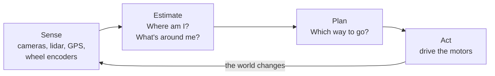

# Start Here

> New to mobile robotics? This path takes you from zero to a working robot localization
> system in four lessons. Each lesson has an interactive demo or a figure you can study, a small calculation you
> do by hand, and a short Python program you can run and change.

---

## What mobile robotics is about

A mobile robot (a warehouse cart, a lawn mower, a Mars rover, a self-driving car) has to keep
answering three questions while it moves:

| Question | Name of the problem | Where it is covered |
|---|---|---|
| **Where am I?** | Localization | This path, then [Localization](../courses/5_localization/README.md) |
| **What does the world around me look like?** | Mapping | [Mapping](../courses/6_mapping/README.md), [SLAM](../courses/7_slam/README.md) |
| **How do I get where I want to go?** | Planning and control | [Control & Planning](../courses/11_control_and_planning/README.md) |

None of these can be answered with certainty. Wheels slip, so the robot never moves exactly
as commanded. Sensors are noisy, sometimes wrong, and never see everything. Mobile robotics
is mostly about acting sensibly anyway, and the tool for that is probability.



## Why start with "Where am I?"

Everything else depends on it. A planner is useless if the robot does not know where it
starts, and a map is useless if the robot cannot place itself on it.

It is also where you meet the single most important idea in the field, the **Bayes
filter**. You keep a *belief* (how likely each possible state is) and update it in a loop:

1. **Predict** when you move: shift the belief and make it more uncertain.
2. **Correct** when you sense: reweight the belief by how well each possibility explains
   the measurement.

Kalman filters, particle filters, occupancy-grid mapping and most SLAM systems are this same
loop with a different way of storing the belief. After this path you will recognize it
everywhere.

## The path

| | Lesson | You will build | New idea | Time |
|---|---|---|---|---|
| 1 | [Where am I? The Bayes filter](1-bayes-filter.md) | A robot that finds itself in a hallway from "door" / "wall" readings | Beliefs, predict and correct | 45 min |
| 2 | [The Kalman filter](2-kalman-filter.md) | A mower that fuses wheel odometry with GPS | Gaussians, Kalman gain | 45 min |
| 3 | [Localizing a real robot: the EKF](3-ekf-localization.md) | A 2D robot that localizes from range-bearing readings of known landmarks | Nonlinear models, Jacobians, filter consistency | 90 min |
| 4 | [The particle filter](4-particle-filter.md) | Localization with no initial guess and landmarks that all look alike | Sampling, resampling, multimodal beliefs | 60 min |

Lessons 1 and 2 have demos that run in your browser, so you can start without installing
anything.

## What you need

- **Math:** high-school algebra. The probability you need is explained when you need it.
  Lessons 3 and 4 use vectors, matrices and derivatives; if they are rusty, the
  [Math & Probability](../courses/1_math_and_probability/README.md) page lists good refreshers.
- **Programming:** basic Python (variables, functions, loops, lists). The examples use NumPy,
  and each line that does something unusual has a comment.
- **Robotics:** none.

## Set up (10 minutes)

You need Python 3.10 or newer and Git.

=== "macOS / Linux"

    ```bash
    git clone https://github.com/robonn-club/guidebook.git
    cd guidebook
    python3 -m venv .venv
    source .venv/bin/activate
    pip install -r examples/requirements.txt
    python examples/bayes_filter_1d.py
    ```

=== "Windows (PowerShell)"

    ```powershell
    git clone https://github.com/robonn-club/guidebook.git
    cd guidebook
    py -m venv .venv
    .venv\Scripts\Activate.ps1
    pip install -r examples/requirements.txt
    python examples/bayes_filter_1d.py
    ```

If it worked, the last command prints the robot's belief after each step, ending with:

```text
step 14   sensed door; most likely cell 7 with p = 0.85 (truly in cell 7)
belief                  █   ▁
robot                   ^
```

??? question "Something went wrong?"

    - **`python` or `python3` not found:** install Python from [python.org](https://www.python.org/downloads/).
      On Windows, tick "Add Python to PATH" during installation.
    - **PowerShell refuses to run `Activate.ps1`:** run
      `Set-ExecutionPolicy -Scope CurrentUser RemoteSigned` once, then try again.
    - **Strange characters instead of bars:** your terminal is not using UTF-8. Windows
      Terminal and the VS Code terminal both work.

## How to get the most out of each lesson

- **Do the small calculation by hand before reading the answer.** It takes five minutes and
  is where the understanding happens.
- **Predict, then run.** Before running an example, guess what it will print. When you are
  wrong, you have found something worth understanding.
- **Answer the "Check yourself" questions** at the end of each lesson before moving on.
- **Break things on purpose.** Each lesson lists the mistakes people typically make.
  Make them deliberately and watch what happens.

## After the path

You will have implemented the three workhorse filters of mobile robotics. Good next steps:

- [Sensor & Motion Models](../courses/3_sensor_motion_models/README.md): where the
  $p(z \mid x)$ and $p(x_t \mid u_t, x_{t-1})$ you used come from for real sensors.
- [Mapping](../courses/6_mapping/README.md): occupancy grids run a tiny Bayes filter
  (Lesson 1) in every cell of a map.
- [SLAM](../courses/7_slam/README.md): localization and mapping at the same time.
- [Control & Planning](../courses/11_control_and_planning/README.md): using the estimate
  to decide where to go.

[Start Lesson 1 :material-arrow-right:](1-bayes-filter.md){ .md-button .md-button--primary }
